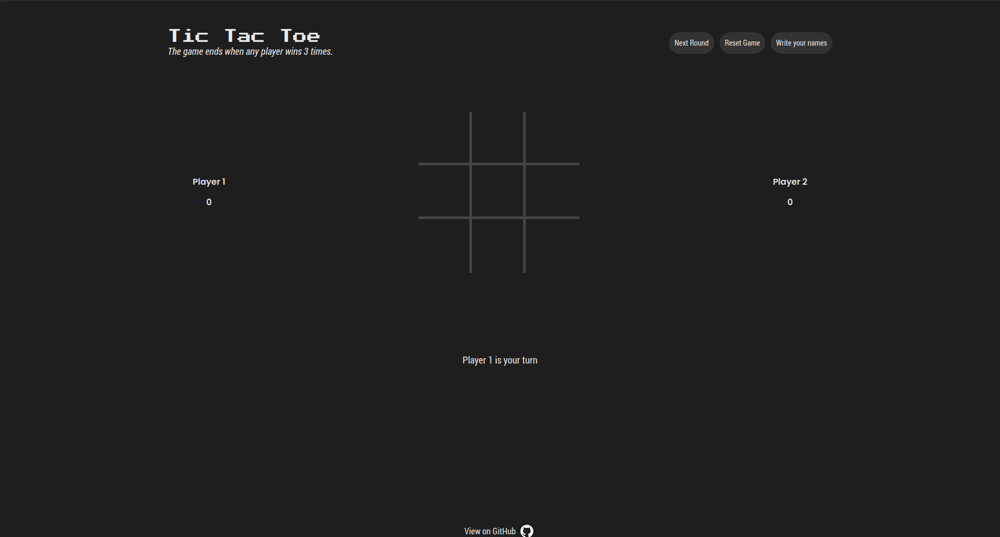

# Tic-Tac-Toe

A modern Tic Tac Toe game built with JavaScript using Factory Functions and the Module Pattern.

Play here: https://rafok69-2000.github.io/Tic-Tac-Toe/

## About the project

This project is a Tic Tac Toe build with vanilla JavasCript,this project was carried out in order to learn through practice the operation of factory functions and the module pattern.

## Features

* Play against another player
* Custom player names
* Score tracking
* Best-of-three winner
* Tie detection
* Player configuration mode

## What I learned...

During this project I practiced:

* Module pattern
* Closures
* Factory functions
* DOM manipulation
* State management
* Event handling

## Acknowledgements

Thanks to The Odin Project for providing a comprehensive curriculum and hands-on projects that helped me strengthen my JavaScript skills.